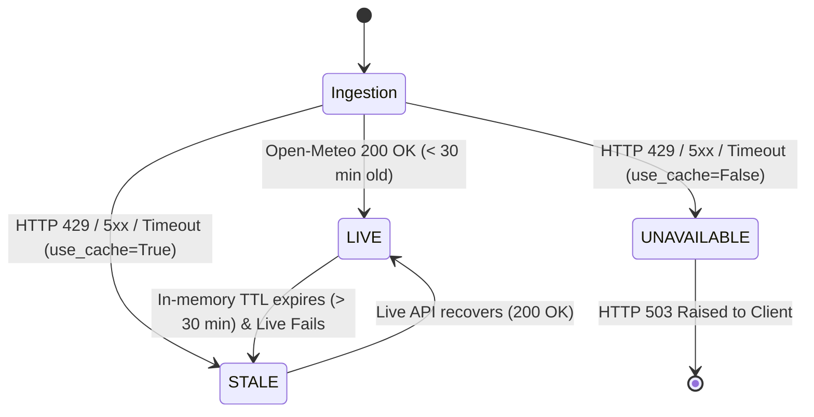

# Rainfall Data Lifecycle & Fallback Contract

**Specification & Operational Contract for SIH2026 Flood Nowcasting Platform**

---

## 1. Overview & Operational Context

In automated hydrological and urban flood nowcasting pipelines, meteorological forecast acquisition from third-party public NWP (Numerical Weather Prediction) APIs presents operational risks:
- Shared cloud platform egress IP addresses (such as Render Free, Heroku, AWS Lambda egress NATs) aggregate traffic from hundreds of tenants.
- Public weather providers like Open-Meteo impose strict daily rate limits (e.g., 10,000 requests/day per public IP).
- Third-party API outages, rate limits (`HTTP 429`), network partitions, and upstream DNS issues can cause unexpected request rejection.

To guarantee continuous urban flood safety and street intelligence operations while adhering to strict scientific integrity, the SIH2026 platform implements a formal **Rainfall Lifecycle & Fallback Contract**.

---

## 2. The Freshness Lifecycle: `LIVE` vs `STALE` vs `UNAVAILABLE`

The rainfall data pipeline operates strictly under three defined lifecycle states:



### A. `LIVE` Status
- **Condition:** Successfully acquired from the upstream weather provider (Open-Meteo) within the active session, or served from memory within the 30-minute freshness TTL.
- **Provenance:** `"Weather forecast (Open-Meteo hourly NWP)"` (or `RainfallProvenance.NWP_FALLBACK`).
- **Semantic Meaning:** Represents real-time forecasts aligned with current satellite/radar assimilation models.
- **Frontend Presentation:** Green status indicator (`LIVE`).

### B. `STALE` Status
- **Condition:** Upstream weather provider query fails (due to `HTTP 429 Rate Limit`, `HTTP 5xx`, timeout, or network error), and the caller has permitted caching (`use_cache=True`, default).
- **Fallback Precedence:**
  1. Valid in-memory cache from earlier successful runs in the current process.
  2. Expired in-memory cache (> 30 minutes old).
  3. Bundled verified static fallback snapshot (`backend/app/data/rainfall/mumbai_open_meteo_cached.json`).
- **Provenance:** Explicitly stamped as `RainfallProvenance.FALLBACK_CACHED_FORECAST` (`"FALLBACK_CACHED_FORECAST"`).
- **Semantic Meaning:** Legitimate, previously validated numerical weather forecast series used to evaluate hydraulic simulations without interruption. It explicitly warns operators and users that observations are historical/cached, never presenting them as current live conditions.
- **Frontend Presentation:** Amber status indicator (`STALE`), notifying users of cached data fallback.

### C. `UNAVAILABLE` Status
- **Condition:** Live query fails AND `use_cache=False` is requested, OR all cache sources (in-memory and bundled file) are missing/unreadable.
- **Behavior:** The adapter raises `RainfallAdapterHTTPError` or `RainfallAdapterTimeout`. The API boundary catches this and issues an explicit `HTTP 503 Service Unavailable`.
- **Semantic Meaning:** Fail-stop mode when callers explicitly demand strict real-time telemetry and reject cached fallbacks.

---

## 3. Fallback Cache Architecture & Mechanics

### Component Diagram

```
+----------------------------------------------------------------------------+
|                             API Request Layer                              |
|   GET /flood/forecast | GET /flood/streets | GET /routing/safe-route        |
+----------------------------------------------------------------------------+
                                      |
                                      v
+----------------------------------------------------------------------------+
|                         OpenMeteoAdapter.fetch()                           |
|                             (use_cache=True)                               |
+----------------------------------------------------------------------------+
        |                                                 |
   (Try Live)                                     (On Any Failure)
        v                                                 v
+-----------------------+                    +-------------------------------+
| Open-Meteo Public API |                    |       OpenMeteoCache          |
| api.open-meteo.com    |                    |  1. In-memory data (fresh)    |
+-----------------------+                    |  2. In-memory data (stale)    |
        |                                    |  3. Verified Fallback File    |
        | 200 OK                             +-------------------------------+
        v                                                 |
+-----------------------+                                 v
| Set in-memory cache   |                    +-------------------------------+
| Return status=LIVE    |                    | Mark status=STALE             |
+-----------------------+                    | Prov=FALLBACK_CACHED_FORECAST |
                                             +-------------------------------+
```

### Static Fallback Asset
- **File Location:** `backend/app/data/rainfall/mumbai_open_meteo_cached.json`
- **Origin:** Verified fixture payload recorded directly from Open-Meteo for the Mumbai pilot coordinate bounds (`19.086115° N, 72.85291° E`, Asia/Kolkata timezone).
- **Contents:** 6 chronological hourly forecast steps with precipitation values in millimeters.
- **Pre-parsing:** Loaded and pre-parsed into an immutable baseline `RainfallSeries` upon adapter initialization.

### Timestamp Handling in Fallback
When activating the static fallback dataset, the reference time anchor uses the baseline acquisition timestamp of the recorded snapshot. This ensures that:
- Hourly intervals remain contiguous.
- Zero intervals are prematurely discarded due to clock skew.
- Exactly 4 full chronological horizons (0h, +1h, +2h, +3h) are fed into the 2D hydrodynamic simulation pipeline.

---

## 4. Open-Meteo Rate Limiting on Shared Cloud Egress IPs

### The Root Cause on Cloud Platforms
When deployed on free or multi-tenant cloud platforms (such as Render Free Web Services):
1. Outbound network traffic is routed through shared cloud NAT gateways.
2. Open-Meteo limits unauthenticated clients to **10,000 requests per day per IP**.
3. Because hundreds of developer applications share the same public IP on Render, the IP pool exhausts Open-Meteo's quota daily.
4. When a cold container boots up, an empty in-memory cache cannot satisfy requests if the first outbound call receives `HTTP 429`.

### How This Contract Solves the Problem
- Even on cold-start boots where the outbound IP is immediately rate-limited, `OpenMeteoCache` has the verified fallback snapshot pre-loaded.
- Instead of throwing `HTTP 503` and crashing the user experience on the frontend map, the backend returns `HTTP 200` with full 4-horizon hydraulic modeling, street risk intelligence, and safe-route calculations.
- The response clearly declares `status="STALE"` and `provenance["rainfall"]="FALLBACK_CACHED_FORECAST"`.
- If an API key (`OPEN_METEO_API_KEY`) is configured in the environment, the adapter attaches it to live requests to bypass IP-based throttling.

---

## 5. Strict Scientific Integrity & Anti-Fabrication Guarantee

Under no circumstances does this implementation violate scientific integrity:

1. **No Fake "LIVE" Data:** Stale fallback forecasts are never presented as `LIVE`. The `status` field explicitly reflects `"STALE"`.
2. **No Claim of Empirical Observations:** Stale data is never claimed to be `OBSERVED`, `RADAR`, `IMD`, or `GAUGE`. Provenance metadata strictly states `FALLBACK_CACHED_FORECAST`.
3. **No Synthetic Equations:** Flood physics, runoff volume conservation, Manning's conveyance, and DEM raster routing remain identical across live and stale forecasts.
4. **Explicit Fail-Stop Preserved:** If callers set `use_cache=False`, the system does NOT use the fallback cache and will fail with `HTTP 503`, respecting programmatic caller requirements.
